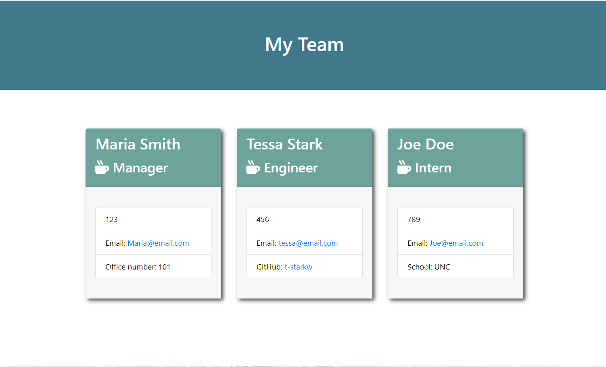

# Team Profile CLI Generator
>### Module 10 UNC Coding Bootcamp Challenge - OOP Team Profile Generator <br><br>
>  This JavaScript command-line application aims to generate a personalized team profile page based on user input. Using the inquirer Node.js module, a user is prompted for information about their team which is subsequently used to dynamically generate an HTML webpage. <br><br>

![JavaScript][js-url]
![HTML][html-url]
![CSS][css-url]
![Node][node-url]





## Installation

Clone the repository:

```sh
git clone git@github.com:t-starkw/what-team-wildcats.git
```

Install the required dependencies:

```sh
npm install
```

Run the project in your local terminal:

```sh
node index
```


## Usage

  >* Run the command `node index` in your favorite terminal to begin the program. Then, answer the prompts accordingly. When you are finished adding members to your team, select the `None` option from the dropdown list.
  >* Once you are finished creating your team, open the newly generated `team.html` page in your preferred browser.
  >* Use the command `npm run reset` to reset the `dist/` folder
  <br><br>
View the `sample.html` output [here](./assets/sample.html) <br><br>
Need extra help? Watch this short [Demo Video](https://drive.google.com/file/d/1veazAwav0G3iTV9c9Xu7A82zzwrVY0Dr/view)

## Tests
>Jest was used to ensure constructor and method functionality. You can view these tests in the `__tests__` directory.
>To perform further tests or view the status of current ones, run the command `npm test` in the terminal.

## Meta

Tessa Starkweather – [LinkedIn](https://www.linkedin.com/in/tessa-starkweather-b61941200/) – tess.starkweather@gmail.com

View my profile – [GitHub](https://github.com/t-starkw)

Distributed under the MIT license. See ``LICENSE`` for more information.

## Contributing

1. Fork it (<https://github.com/t-starkw/what-team-wildcats/fork>)
2. Create your feature branch (`git checkout -b feature/fooBar`)
3. Commit your changes (`git commit -am 'Add some fooBar'`)
4. Push to the branch (`git push origin feature/fooBar`)
5. Create a new Pull Request

## License
[](https://opensource.org/licenses/MIT)
  
https://opensource.org/licenses/MIT 

<!-- Markdown link & img dfn's -->

[node-url]: https://img.shields.io/badge/Node.js-43853D?style=for-the-badge&logo=node.js&logoColor=white
[js-url]: https://img.shields.io/badge/JavaScript-F7DF1E?style=for-the-badge&logo=javascript&logoColor=black
[html-url]: https://img.shields.io/badge/HTML5-E34F26?style=for-the-badge&logo=html5&logoColor=white
[css-url]: https://img.shields.io/badge/CSS3-1572B6?style=for-the-badge&logo=css3&logoColor=white
[python-url]: https://img.shields.io/badge/Python-14354C?style=for-the-badge&logo=python&logoColor=white
[express-url]: https://img.shields.io/badge/Express.js-404D59?style=for-the-badge
[react-url]: https://img.shields.io/badge/React-20232A?style=for-the-badge&logo=react&logoColor=61DAFB
[jquery-url]: https://img.shields.io/badge/jQuery-0769AD?style=for-the-badge&logo=jquery&logoColor=white
[bs-url]: https://img.shields.io/badge/Bootstrap-563D7C?style=for-the-badge&logo=bootstrap&logoColor=white
[tw-url]: https://img.shields.io/badge/Tailwind_CSS-38B2AC?style=for-the-badge&logo=tailwind-css&logoColor=white
[mongo-url]: https://img.shields.io/badge/MongoDB-4EA94B?style=for-the-badge&logo=mongodb&logoColor=white
[mysql-url]: https://img.shields.io/badge/MySQL-00000F?style=for-the-badge&logo=mysql&logoColor=white
[heroku-url]: https://img.shields.io/badge/Heroku-430098?style=for-the-badge&logo=heroku&logoColor=white
[sqlize-url]: https://img.shields.io/badge/sequelize-323330?style=for-the-badge&logo=sequelize&logoColor=blue
[jswtoken-url]: 	https://img.shields.io/badge/json%20web%20tokens-323330?style=for-the-badge&logo=json-web-tokens&logoColor=pink
[apollo-url]: https://img.shields.io/badge/-ApolloGraphQL-311C87?style=for-the-badge&logo=apollo-graphql
[graphql-url]: https://img.shields.io/badge/-GraphQL-E10098?style=for-the-badge&logo=graphql&logoColor=white
